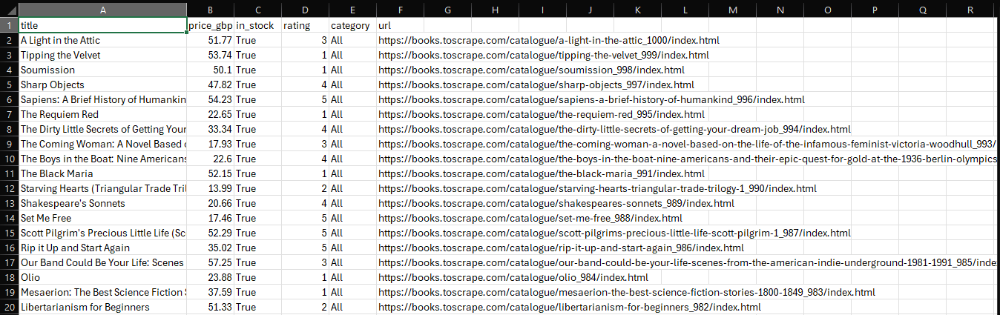

# E-Commerce Product Scraper

A web scraper demonstrating pagination handling, retry logic, rate limiting, and structured data export (CSV + JSON).

**Target:** [books.toscrape.com](https://books.toscrape.com) — a sandbox site built for scraping practice (safe to publish against, unlike scraping Amazon/eBay directly).

## Features
- Full pagination (auto-detects last page)
- Retry with exponential backoff on failed requests
- Rate limiting (randomized delay between requests)
- Export to CSV and JSON
- Logging to file

## Setup
```bash
pip install requests beautifulsoup4
python ecommerce_scraper.py
```

## Limitations
- Works on static/server-rendered pages. JS-rendered sites need a browser-based tool (Playwright).
- Anti-bot protection (Cloudflare, CAPTCHAs) needs extra work: proxies, browser fingerprinting, slower request patterns.
- Selectors are specific to this site's HTML — a different target site needs its own selectors checked via browser DevTools.

---

## Русская версия

Скрапер, демонстрирующий обработку пагинации, повторные попытки при ошибках, ограничение частоты запросов и экспорт данных (CSV + JSON).

**Цель:** [books.toscrape.com](https://books.toscrape.com) — сайт-песочница для практики парсинга (безопасно публиковать, в отличие от парсинга Amazon/eBay напрямую).

### Возможности
- Полная пагинация (сам находит последнюю страницу)
- Повторные попытки с нарастающей паузой при сбоях
- Ограничение частоты запросов (случайные паузы)
- Экспорт в CSV и JSON
- Логирование в файл

### Установка
```bash
pip install requests beautifulsoup4
python ecommerce_scraper.py
```

### Ограничения
- Работает со статичными/серверно-рендеренными страницами. Для сайтов с JS-рендерингом нужен инструмент на основе браузера (Playwright).
- Защита от ботов (Cloudflare, капчи) требует доработки: прокси, эмуляция браузера, более медленные запросы.
- Селекторы заточены под HTML именно этого сайта — для другого сайта нужно проверять свои селекторы через DevTools браузера.
